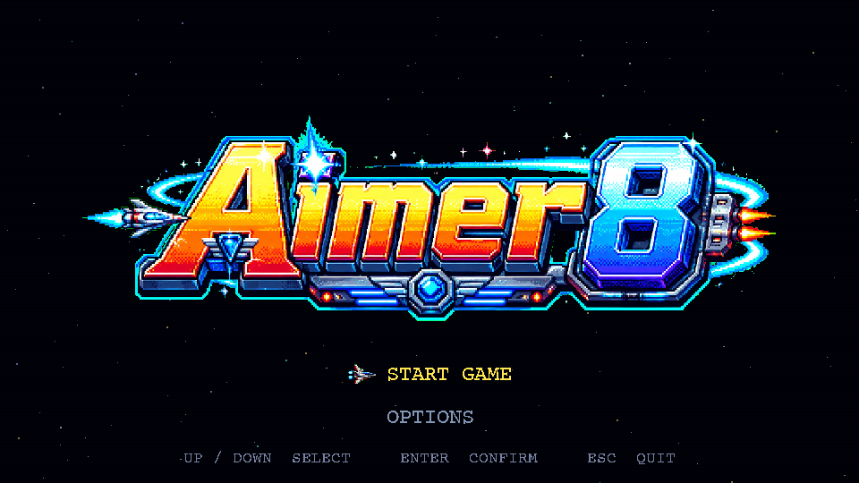
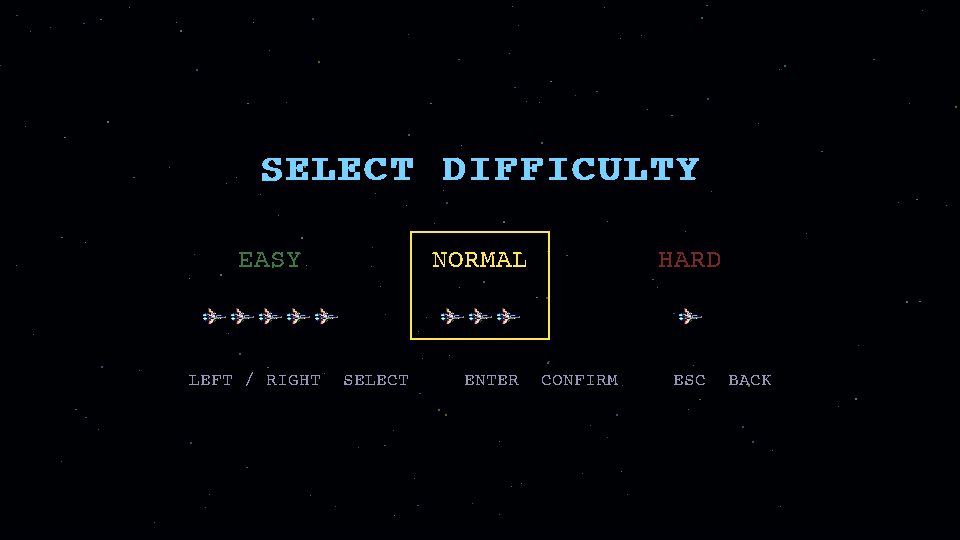
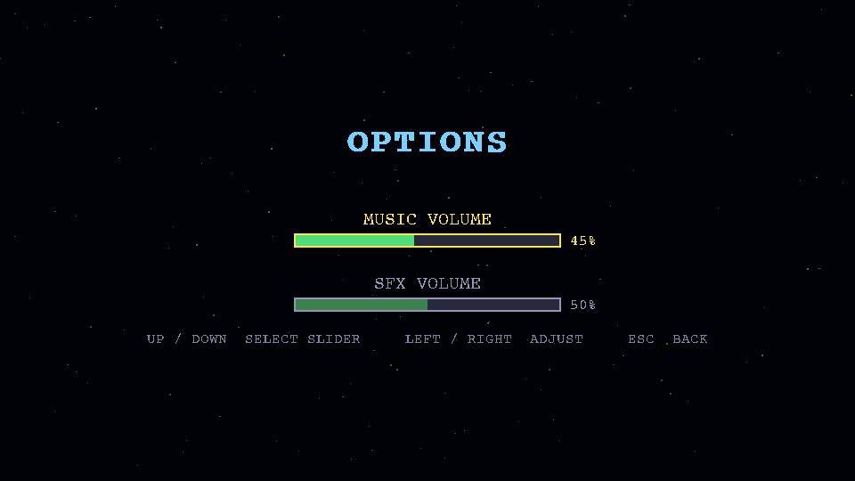
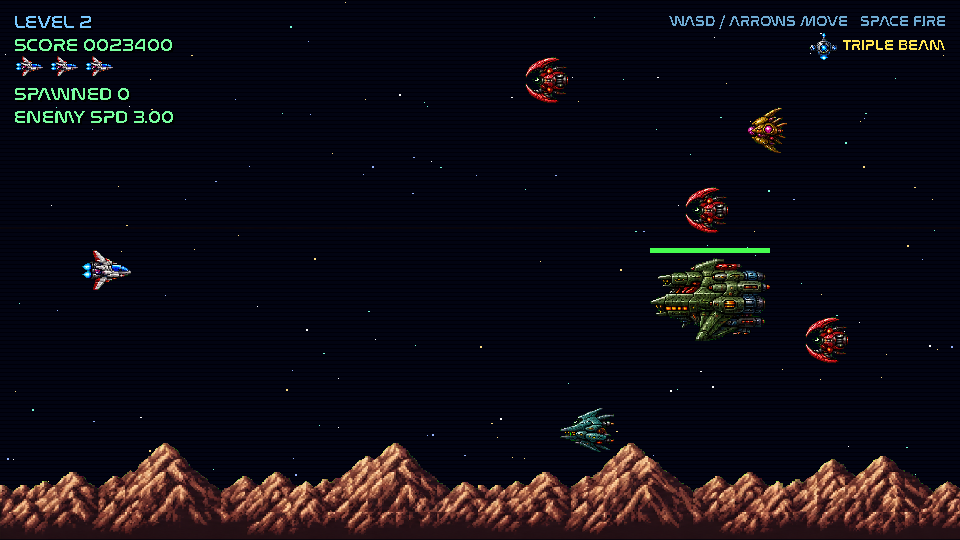

# Aimer 8

**Aimer 8** is a 16-bit style side-scrolling space shooter built with **Python** and **Pygame**.

Pilot a pixel-art spaceship, blast through increasingly dangerous enemy waves, dodge formation attacks, and survive as long as you can.

## Screenshots

### Main Menu


### Difficulty Selection


### Options


### Gameplay


## Features

- 16-bit / Super Nintendo inspired pixel-art visual style
- Side-scrolling shooter gameplay
- **Difficulty selection**: Easy (5 ships), Normal (3 ships), Hard (1 ship)
- **Options menu**: adjustable music and SFX volume sliders
- Two-frame animated player ship
- Player movement with **WASD** or **Arrow Keys**
- Laser shooting with **Spacebar**
- Procedurally generated retro laser and explosion sound effects
- Background music support:
  - `audio/main.mp3` — main menu and game-over screen
  - `audio/level.mp3` — during gameplay
- Starfield background with parallax scrolling
- Distant planets, nebulae, and space station background elements (seeded, deterministic order each run)
- 8 different enemy ship sprites, picked at random
- Enemy progression:
  - Normal enemies spawn from the right
  - Every **15 spawns** — a special wave: **enemy trains** and **large armored enemies** alternate (train at 15, big at 30, train at 45, big at 60, …)
  - Sinusoidal **enemy train** formation, ship count grows with speed
  - **Large armored enemy** takes 5 hits to destroy
  - Every **90 spawns** — enemy speed increases
- **Boss monster** every **60 spawns**:
  - All other spawns pause until the boss is destroyed
  - Glides in, hovers and bobs, and takes 40 hits (with a health bar)
  - Attacks with a leftward fan ("radius wave") of bullets; the pattern is **seeded, so it is identical every encounter and can be learned**
  - Cannot be killed by ramming — contact (and its bullets) cost the player a life
  - Destroying it awards **+1 extra life** and a big score
- Ship-icon HUD (remaining lives shown as ship sprites)
- Player blink and invulnerability after taking damage
- Screen shake on collision
- Game-over screen with restart or return to menu

## Screens and Assets

The game expects the following project structure:

```text
Aimer-8/
  main.py
  README.md
  aimer8.spec
  create_icon.py
  gfx/
    sprites.png
    title.png
    icon.ico
    icon.png
  audio/
    main.mp3
    level.mp3
```

### Required graphics

Place these files in the `gfx/` folder:

- `sprites.png` — sprite sheet (1254×1254, RGBA with real transparency) containing the player ship animation frames, enemy ships, the big armored enemy, the boss monster, explosions, projectiles, planets, nebulae, and space station art.
- `title.png` — main logo for the title screen.
- `icon.ico` / `icon.png` — window and taskbar icon (generated by `create_icon.py`).

`sprites.png` uses a real alpha channel, so no chroma-key removal is needed. `title.png` still uses solid green `#00FF00` as a chroma-key background, which the game removes in-game.

### Required audio

Place these files in the `audio/` folder:

- `main.mp3` — loops during the main menu and game-over screen.
- `level.mp3` — loops during gameplay.

Sound effects for lasers and explosions are generated in code; no external SFX files are required.

## Installation

Install Python 3.10+ and the required packages:

```bash
pip install pygame pillow
```

## Running the Game

```bash
python main.py
```

## Windows Executable

```bash
# Generate the icon (requires Pillow)
python create_icon.py

# Build the executable (requires PyInstaller)
pip install pyinstaller
pyinstaller aimer8.spec
```

The compiled binary will appear in `dist/Aimer8.exe`.

## Controls

| Action | Keys |
|---|---|
| Move | WASD or Arrow Keys |
| Fire | Spacebar |
| Navigate menus | Arrow Keys / WASD |
| Confirm | Enter |
| Back / Quit | Escape |
| Restart after game over | R |
| Return to menu after game over | M |
| Open options (main menu) | O |

## Gameplay Rules

- Destroy enemies to increase your score.
- Normal enemies are destroyed with **1 hit** (100 pts).
- Every **15 spawns** a special wave enters, alternating between two types:
  - **Train formation** — ships travel in a sinusoidal wave pattern, count equals the current speed tier (150 pts each).
  - **Large enemy** — takes **5 hits** and awards more points (700 pts).
- Every **60 spawns** a **boss monster** appears (3000 pts):
  - All other spawns pause until the boss is destroyed.
  - It takes **40 hits** and fires a leftward fan of bullets in a fixed, learnable pattern.
  - Ramming it or being hit by its bullets costs a life; it cannot be killed by ramming.
  - Destroying the boss grants **+1 extra life**.
- Every **90 enemies**, all enemy speeds increase.
- Colliding with an enemy (or a boss bullet) removes one ship (life).
- The game ends when all ships are lost.

## Difficulty

| Difficulty | Starting ships |
|---|---|
| Easy | 5 |
| Normal | 3 |
| Hard | 1 |

Select difficulty from the menu that appears after pressing **Enter** on the title screen.

## Configuration

Most gameplay values can be edited near the top of `main.py`:

```python
WIDTH, HEIGHT = 960, 540
FPS = 60

PLAYER_SPEED = 5.0
BULLET_SPEED = 10.0
FIRE_COOLDOWN = 170  # ms between shots

BASE_ENEMY_SPEED = 3.0
SPEED_INCREASE_EVERY = 90
TRAIN_EVERY = 15  # special wave every N spawns; trains and big enemies alternate

BOSS_EVERY = 60         # spawn a boss every N spawns
BOSS_HP = 40            # hits to destroy the boss
BOSS_FIRE_MS = 950      # ms between boss volleys
BOSS_VOLLEY = 9         # bullets per volley
BOSS_SPREAD = 72        # half-arc (degrees) of the bullet fan
BOSS_BULLET_SPEED = 4.4
BOSS_SEED = 20250625    # fixed seed -> identical, learnable attack pattern

VOL = {"music": 0.45, "sfx": 0.5}  # default volumes (also adjustable in-game)
```

## Notes About Generated Assets

The sprite sheet and logo are designed for a retro 16-bit style. The game uses chroma-key removal for green `#00FF00`, so avoid using that exact color inside visible sprite artwork unless it is meant to become transparent.

## AI-Generated Code and Asset Disclaimer

This project was created with assistance from AI tools. Portions of the source code, game structure, generated sound logic, sprite-sheet planning, and visual asset prompts were produced or refined using AI assistance.

The code and assets should be reviewed, tested, and modified as needed before being used in a production or commercial project. AI-generated output may contain mistakes, inefficient code, unintentional similarities, or licensing concerns depending on how generated assets are created and used.

No warranty is provided. Use this project at your own discretion.

## License

This project is licensed under the **MIT License**. See the [LICENSE](LICENSE) file for details.

## Credits

- Game concept, implementation direction, and project assembly: Pascal Brax
- Code assistance and asset-generation support:
  - GFX & code: ChatGPT, Claude
  - Music: Suno
- Built with Python and Pygame
